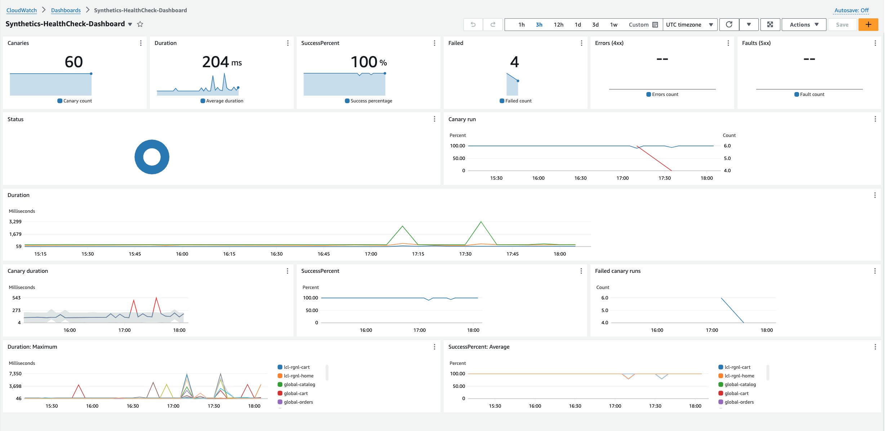
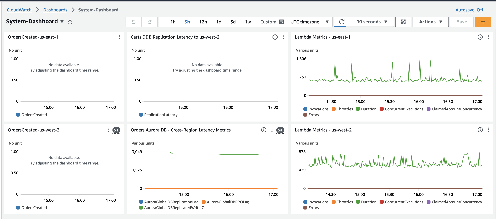

# Guidance for a Multi-Region Microservice on AWS

## Getting started

This guidance helps customers design and operate a multi-Region microservice based architecture for an e-commerce platform on AWS using services like Amazon Elastic Container Services (ECS), Amazon Aurora Global Database, Amazon Aurora DSQL, Amazon DynamoDB Global Tables with multi-Region strong consistency (MRSC), and Application Recovery Controller (ARC) Region Switch. The solution is deployed across two Regions in an active/active configuration where both regions serve traffic simultaneously. This is possible because all services except Catalog are either stateless or use globally strongly consistent datastores (Aurora DSQL for Orders, DynamoDB Global Tables with MRSC for Carts). The Catalog service uses Amazon Aurora Global Database, which is sufficient for active/active because catalog data is read in-region and updated infrequently by an external process (in the event of data loss due to failover, updates can be re-run). The solution leverages an ARC Region Switch Plan to orchestrate regional failover through an automated workflow that scales up ECS services in the target region, fails over the Aurora Global Database, and shifts DNS traffic via ARC-managed Route53 health checks.

## Application Overview

The sample application is an e-commerce platform. The front-end runs as a service in Amazon Elastic Container Service (ECS), supported by back-end microservices (catalog, assets, orders, carts, checkout) for displaying products, adding items to carts, and placing orders. The application uses Amazon Aurora Global Database for the Catalog service, Amazon Aurora DSQL for the Orders service, and Amazon DynamoDB Global Tables with multi-Region strong consistency for the Carts service.


## Architecture

### 1. Operating in the active/active state


1. Amazon Route53 Failover records use Route53 Application Recovery Controller (ARC) managed Health Checks to route requests to the active regions

2. Application Load Balancers (ALB) send requests to the UI tasks on Amazon Elastic Container Service (ECS).  Depending on the page being accessed, the UI will make a service call to the appropriate service via ECS Service Connect

3. The “Catalog” service uses Amazon Aurora Global Database. Writes go to the primary writer instance and are replicated asynchronously to the secondary region. Reads are served locally in each region.

4. The “Orders” service uses Amazon Aurora DSQL, a serverless distributed SQL database that provides active-active replication with strong consistency across regions.

5. The “Carts” service uses Amazon DynamoDB Global Tables with multi-Region strong consistency (MRSC), enabling strongly consistent reads and writes in both regions simultaneously.

6. The checkout service uses Amazon ElastiCache for Redis for temporarily caching the contents of the cart until the order is placed.

7. The orders service leverages Amazon RabbitMQ broker to publish order creation events for any downstream consumption purposes.

8. Amazon CloudWatch Synthetics from each region sends requests to the application in each region via the ALB’s address and to the DNS name resolved through Route53 and pushes the metrics, logs and traces to CloudWatch.

9. Amazon Application Recovery Controller (ARC) Region Switch Plan orchestrates regional failover by scaling up ECS services, failing over the Aurora Global Database, and shifting DNS traffic via managed health checks.


### 2. Cross Region Failover 


1. An operator executes the Application Recovery Controller (ARC) Region Switch Plan

2. ARC scales up ECS services to handle 100% of all site traffic

3. ARC then executes Aurora Global Database managed failover which promotes the standby region to the primary for writes (former primary is rebuilt as a secondary by the Aurora service)

4. ARC then toggles the Route53 Health Check for the failing region to “unhealthy” so that DNS returns only the remaining healthy region as clients resolve the application’s fully-qualified domain name

5. An operator uses the SSM runbook to recover a copy of the old primary database from a snapshot and compare the data in the new primary database to the old and create a missing transaction report


## Resilience Modeling with AWS Resilience Hub

The `make ngrh` target models this application in AWS Resilience Hub (`resiliencehubv2`) so its resilience can be assessed against explicit RTO/RPO targets. The model has three layers — **user journeys**, **services**, and **resiliency policies (tiers)** — described below along with the rationale for each mapping.

### User journeys → services

A *user journey* is a business-meaningful path through the application. Each journey depends on the ECS services that fulfill it:

| User journey | Services exercised |
|---|---|
| Browse Catalog | ui, catalog, assets |
| Manage Cart | ui, cart |
| Checkout & Place Order | ui, checkout, orders, cart |
| View Orders | ui, orders |

Notes:
* `ui` is the only public entry point (ALB + Route 53/ARC health checks) and fans out to the backends via ECS Service Connect, so it participates in every journey.
* `checkout` orchestrates the order: it reads the cart and calls `orders` to create the order on submit (an inter-service dependency beyond the UI-centric hub-and-spoke diagram).
* Operational concerns (CloudWatch Synthetics canaries, the ARC Region Switch runbook) are **not** modeled as journeys — they are detection/recovery mechanisms, not user-facing paths.

### Resiliency policies (tiers)

Two policies express the resilience requirements. Each uses **one RTO/RPO bar applied across all disruption types** (AZ, hardware, software, Region); the per-disruption breakdown comes from the assessment, not from differentiated targets.

| Tier | RTO | RPO | Applied to journeys |
|---|---|---|---|
| **Tier-1** (revenue funnel) | 10 min | 0 | Browse Catalog, Checkout & Place Order |
| **Tier-2** (standard) | 15 min | 5 min | Manage Cart, View Orders |

Justification:
* **Tier-1 = the revenue funnel.** Browsing the catalog gates *all* sales (no browse → no purchase) and checkout is the revenue transaction itself, so both get the strictest targets.
* **Tier-1 RTO is 10 minutes — the realistic Active/Active floor.** Resilience Hub treats ~10 minutes as the minimum achievable RTO for an Active/Active topology (failure detection + DNS TTL + connection drain + service stabilization). An aspirational 5-minute target is flagged as unachievable across every service, which drowns out the genuinely actionable findings; 10 minutes is the honest target and lets the real architecture gaps surface.
* **Tier-2 = important but degraded-tolerable.** Managing the cart (mid-funnel) and viewing past orders (post-purchase/support) can tolerate a longer recovery and small data-loss window without direct revenue impact.
* **RPO 0 for Tier-1 is honest for the write path** because Orders uses Aurora DSQL and Carts uses DynamoDB Global Tables — strongly consistent across Regions. The only data lost in a regional failover is in-flight checkout session state in ElastiCache (not a system of record; the customer simply re-enters it).
* **Browse Catalog is a read path on Aurora Global Database (asynchronous replication),** so a strict RPO 0 is not physically achievable there. This is an accepted compensating control rather than a defect: catalog data is read-only in-Region and written by an external, re-runnable ingest from an external system of record, so any unreplicated catalog updates are recovered by re-running ingest with no unrecoverable data loss. This rationale is recorded as a Resilience Hub **assertion** on the `catalog` service.

### Service tier = strictest journey it serves

A service can carry only one policy, so each service inherits the **strictest tier of any journey it participates in**:

| Service | In journeys | Effective tier |
|---|---|---|
| ui | all four (incl. two Tier-1) | Tier-1 |
| catalog | Browse Catalog (T1) | Tier-1 |
| assets | Browse Catalog (T1) | Tier-1 |
| checkout | Checkout & Place Order (T1) | Tier-1 |
| orders | Checkout (T1) + View Orders (T2) | Tier-1 |
| cart | Checkout (T1) + Manage Cart (T2) | Tier-1 |

All six services resolve to Tier-1 because every service participates in at least one revenue-funnel (Tier-1) journey. This is intentional: a service shared between a Tier-1 and a Tier-2 journey **must** meet the stricter target to satisfy the Tier-1 journey. The tier differentiation therefore lives at the **journey** layer (two Tier-1, two Tier-2), while the **service** layer is uniformly Tier-1 here. An application with services used *exclusively* by lower-tier journeys would show a mix of service tiers.

### Region scope

The application is modeled as a single multi-Region system with `disasterRecoveryApproach = ACTIVE_ACTIVE` for both the multi-AZ and multi-Region targets — both Regions serve traffic and the data tier is strongly consistent (Aurora DSQL, DynamoDB Global Tables). ECS capacity that ARC scales up on failover is reflected as a contributor to recovery time (RTO), not as a different DR classification.


## Pre-requisites

* To deploy this example guidance, you need an AWS account (We suggest using a temporary or a development account to 
  test this guidance), and a user identity with access to the following services:

    * AWS CloudFormation
    * Amazon Virtual Private Cloud (VPC)
    * Amazon Elastic Compute Cloud (EC2)
    * Amazon Elastic Container Services (ECS)
    * Amazon Relational Database Service (RDS)
    * Amazon ElastiCache for Redis
    * Amazon Aurora Global Database 
    * AWS Identity and Access Management (IAM)
    * AWS Secrets Manager
    * AWS Systems Manager
    * Amazon Route 53
    * AWS Lambda
    * Amazon CloudWatch
    * Amazon Simple Storage Service
    * Amazon Application Recovery Controller

* Install the latest version of AWS CLI v2 on your machine, including configuring the CLI for a specific account and region
profile.  Please follow the [AWS CLI setup instructions](https://github.com/aws/aws-cli).  Make sure you have a 
default profile set up; you may need to run `aws configure` if you have never set up the CLI before. 

* Install Python version 3.12 on your machine. Please follow the [Download and Install Python](https://www.python.org/downloads/) instructions.

* Install `make` for your OS if it is not already there.

* Install `zip` for your OS if it is not already there (used to package source for AWS CodeBuild). Container images are built via AWS CodeBuild — no local Docker installation is required.

### Regions

This demonstration by default uses `us-east-1` as the primary region and `us-west-2` as the backup region. These can be changed in the Makefile.

## Deployment

For the purposes of this workshop, we deploy the CloudFormation Templates via a Makefile. For a production workload, you'd want to have an automated deployment pipeline.  As discussed in this 
[article](https://aws.amazon.com/builders-library/automating-safe-hands-off-deployments/?did=ba_card&trk=ba_card), a multi-region pipeline should follow a staggered deployment schedule to reduce the blast radius of a bad deployment.  
Take particular care with changes that introduce possibly backwards-incompatible changes like schema modifications, and make use of schema versioning.


## Configuration
Before starting deployment process please update the following variables in the `deployment/Makefile`:

**ENV** - It is the unique variable that indicates the environment name. Global resources created, such as S3 buckets, use this name. (ex: -dev)

**PRIMARY_REGION** - The AWS region that will serve as primary for the workload

**STANDBY_REGION** - The AWS region that will serve as standby or failover for the workload

## Deployment Steps

We use make file to automate the deployment commands. The make file is optimized for Mac. If you plan to deploy the solution from another OS, you may have to update few commands.

1. Deploy the full solution from the `deployment` folder
    ```shell
    make deploy
    ```

## Verify the deployment

**Deployment Outputs**

Verify deployment outputs after a successful deployment. If you are deploying the solution to **us-east-1** a sample deployment output will look like this:- 

Canaries:
* https://us-east-1.console.aws.amazon.com/cloudwatch/home?region=us-east-1#synthetics:canary/list
* https://us-west-2.console.aws.amazon.com/cloudwatch/home?region=us-west-2#synthetics:canary/list

Region Switch Plan:
* Use `aws arc-region-switch start-plan-execution` to initiate failover

**Optional Windows clients (diagnostics only)**

Windows EC2 clients for in-VPC browser testing are **not** deployed by default.
If you need them for diagnostics, deploy them in both regions with:

```bash
make client ENV=<env>
```

This prints the Fleet Manager console links and the Administrator password
secret locations for each client. `make destroy-all` still cleans them up if
they were deployed.

## Observability

Each Region is provisioned with a CloudWatch dashboard that shows the healthchecks as reported by the Synthetic Canaries in each Region. 



In addition, a System Dashboard is also provisioned that shows key metrics like the Order created in each Region, and the replication latency metrics for 
DynamoDB and Aurora Global database.



## Injecting Chaos to simulate failures
To induce failures into your environment, you can use the `multi-region-scenario.yml` and cause a regional service disruption. This cloudformation template uses AWS Fault Injection Service to simulate disruptions like pausing DynamoDB Global Table replication and disrupting cross region network connectivity from subnets. Running this experiment will also allow you to perform a Regional failover and observe the reconciliation process.

The chaos experiment template is already deployed as part of the solution deployment process.

The following sequence of steps can be used to test this solution.

1. The first step is to get the experimentTemplateId to use in our experiment; use the below command for that and make a note of the id value
`export templateId=$(aws fis list-experiment-templates --output json --no-cli-pager | jq -r '.experimentTemplates[] | select(.tags["Name"] == "Cross-Region: Connectivity to us-west-2") | .id')`

2. Execute the experiment in the primary Region (us-east-1) using the following command using the templateId from the previous step.
`aws fis start-experiment --experiment-template-id $templateId`

## Cleanup

Note: If you have created reconciliation Amazon Aurora Database Clusters and Database Instances in the Standby Region, please delete all those instances before going to the next step.

Delete all the cloudformation stacks and associated resources from both the Regions, by running the following command from the `deployment` folder
    ```shell
    make destroy-all
    ```

## Cost

The following table provides a sample monthly cost breakdown for running the
default deployment 24/7 in the US East (N. Virginia) and US West (Oregon)
Regions. Numbers are derived from the templates in `deployment/` (resource
counts, instance sizes, schedules) and current public AWS list pricing for
those Regions; usage-driven items (data transfer, log volume, DSQL
Processing Units) are estimated for an idle / light-load workload and will
scale with traffic.

The default canary schedule (`rate(1 minute)` × 12 canaries × 2 Regions) is
the single largest contributor. Reducing canaries to a 5-minute schedule
drops monthly cost by roughly $1,000.

## Summary
| Cost Type | Amount (USD) |
|-----------|-------------|
| Upfront Cost | $0.00 |
| Monthly Cost | ~$2,850 |
| Total 12 Months Cost* | ~$34,200 |

\* Includes upfront cost. Most line items are flat 24/7 — actual cost will
vary with the canary schedule, log retention, and workload volume.

## Detailed Estimate

### Per-Region Costs (each of US East and US West)

| Service | Monthly Cost | Configuration |
|---------|--------------|----------------|
| ECS Fargate Spot | $97 | 6 services × 2 tasks (FARGATE_SPOT, ~70% off on-demand): 4 × (1 vCPU / 2 GB) + 2 × (0.25 vCPU / 0.5 GB), Linux/x86 24/7 |
| Application Load Balancer | $20 | 1 internal ALB ($16 base + ~$4 LCU) |
| VPC Interface Endpoints | $329 | 15 endpoints × 3 AZs × $0.01/AZ-hr (S3 + DynamoDB are gateway endpoints, free) |
| Aurora MySQL Serverless v2 | $175 | 2 instances × 1 ACU minimum × $0.12/ACU-hr (idle) |
| Amazon MQ (RabbitMQ) | $65 | mq.m7g.medium single-instance broker |
| ElastiCache for Redis | $12 | cache.t3.micro single-node replication group |
| CloudWatch Synthetics | $620 | 12 canaries × 1-minute schedule × $0.0012/run (DOMINANT cost) |
| Windows EC2 client | $15 | optional (`make client`), t3.small for in-VPC browser testing — not deployed by default |
| DynamoDB Global Table (MRSC) | $0.30 | small dataset, replicated to other Region |
| DynamoDB Streams | $0.001 | low GetRecord volume |
| AWS FIS | $2 | chaos experiments, 20 action-minutes/run |
| Secrets Manager | $20 | ~50 secrets ($0.40 each) |
| KMS | $1 | 1 multi-Region CMK + light request volume |
| CloudWatch Logs | ~$30 | ECS task + app logs (varies with traffic) |
| **Per-Region subtotal** | **~$1,386** | |

### Shared / Global Costs (charged once, not per Region)

| Service | Monthly Cost | Configuration |
|---------|--------------|----------------|
| Aurora DSQL | ~$5 | multi-Region active-active cluster, idle storage + low DPU |
| ARC Region Switch | $70 | 1 plan |
| Route 53 | $2 | 1 hosted zone + 2 ARC-managed health checks |
| AWS CodeBuild | $1 | sidecar mirror builds, ~6 × 5 min |
| **Global subtotal** | **~$78** | |

### Total

| | Monthly Cost |
|---|---|
| US East (N. Virginia) | ~$1,386 |
| US West (Oregon) | ~$1,386 |
| Shared / global | ~$78 |
| **Total** | **~$2,850** |

### Cost-reduction levers

If the goal is to evaluate the architecture rather than continuously exercise
it, the following changes drop ~$1,300/month without affecting the
multi-Region pattern itself:

* Increase canary schedule from `rate(1 minute)` to `rate(5 minutes)` in
  `deployment/canaries.yaml` → saves ~$1,000/month.
* Trim VPC interface endpoints to a single AZ (or rely on NAT for the
  services that don't need private connectivity) → saves up to ~$220/month.
* Windows EC2 clients are opt-in (`make client`) — skip them entirely, or
  shut them down when not in use → saves ~$30/month.
* Run `make destroy-all` between evaluation sessions and redeploy on
  demand — the templates create cleanly and most stateful resources are
  small at idle.

## Acknowledgement
*AWS Pricing Calculator provides only an estimate of your AWS fees and doesn't include any taxes that might apply. Your actual fees depend on a variety of factors, including your actual usage of AWS services.*
*More than 100 AWS products are available on AWS Free Tier today. Click [here](https://aws.amazon.com/free/) to explore our offers.*

*Note: We recommend creating a [Budget](https://docs.aws.amazon.com/cost-management/latest/userguide/budgets-managing-costs.html) through [AWS Cost Explorer](https://aws.amazon.com/aws-cost-management/aws-cost-explorer/) to help manage costs. Prices are subject to change. For full details, refer to the pricing webpage for each AWS service used in this Guidance.*

## Security
See [CONTRIBUTING](CONTRIBUTING.md) for more information.

### Considerations

The codebase does not address these CDK_NAG rules since this code is NOT INTENDED for Production usage. The codebase has been created with the sole intention of demonstrating multi-Region architectural patterns with the assumption that the end-user will harden the codebase to meet the security considerations as required.

Security scan suppressions for Checkov, cfn-guard, and cfn_nag findings are documented inline on the affected CloudFormation resources via `Metadata` blocks. OpenAPI scan suppressions are in `.checkov.yaml`. The following findings are in non-CloudFormation files where inline suppression is not supported:

| Rule ID            | Cause                                                                                                                         | Explanation                                                                                                                                                                                                                                                                                                           |
| ------------------ |-------------------------------------------------------------------------------------------------------------------------------|-----------------------------------------------------------------------------------------------------------------------------------------------------------------------------------------------------------------------------------------------------------------------------------------------------------------------|
| AwsSolutions-SMG4  | The secret does not have automatic rotation scheduled for resources ARNs being stored as secrets.                             | The demo code leverages secrets manager to share information about AWS resources like ARNs across Regions. Such secrets are not eligible for rotation. However, Aurora databases credentials being used and setup for rotation using the [secrets-rotation](deployment/database/secrets-rotation) stack.              |
| AwsSolutions-IAM5  | The IAM entity contains wildcard permissions and does not have a cdk-nag rule suppression with evidence for those permission. | IAM role and permissions used by services like the AWS Fault Injection Service are scoped not a specific resources because multiple resources will get affected when simulating a regional power outage scenario. In cases such as these, the permissions are restricted to resources within the same account though. |
| AwsSolutions-IAM4  | The IAM user, role, or group uses AWS managed policies.                                                                       | This is a demo codebase, hence using AWS managed policies where possible.                                                                                                                                                                                                                                             |
| AwsSolutions-RDS10 | The RDS instance or Aurora DB cluster does not have deletion protection enabled.                                              | This is a demo codebase, hence deletion protection is not enabled.                                                                                                                                                                                                                                                    |
| AwsSolutions-RDS11 | The RDS instance or Aurora DB cluster uses the default endpoint port.                                                         | This is a demo codebase, hence default ports are used for RDS.                                                                                                                                                                                                                                                        |
| AwsSolutions-RDS14 | The RDS Aurora MySQL cluster does not have Backtrack enabled.                                                                 | This is a demo codebase, hence backtracking is not enabled.                                                                                                                                                                                                                                                           |
| bosco/external-cdn | External CDN reference in UI layout template.                                                                                 | The demo UI references Bootstrap CSS from a public CDN. In production, host static assets on Amazon CloudFront or S3.                                                                                                                                                                                                 |
| bosco/non-ecr-docker-image | Dockerfiles use public Docker Hub base images.                                                                       | Expected for an open-source sample. In production, mirror base images to private ECR repositories.                                                                                                                                                                                                                    |
| B303 / python.sqlalchemy.security | MD5/SHA1 usage and raw SQL in vendored PyMySQL library.                                                         | These findings are in third-party vendored code (PyMySQL 1.1.0), not project code. The library is MIT-licensed and widely used.                                                                                                                                                                                       |

## License
This library is licensed under the MIT-0 License. See the [LICENSE](LICENSE) file.