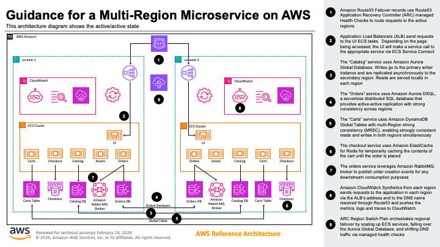
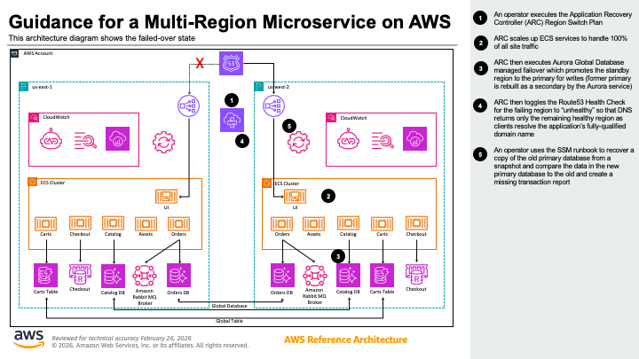
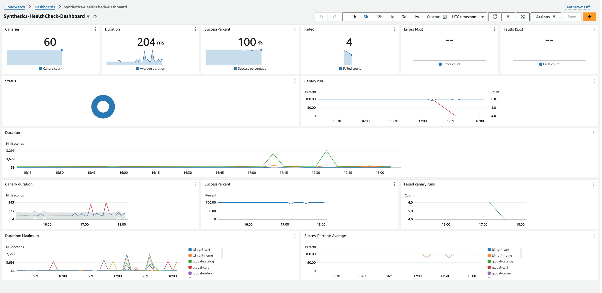
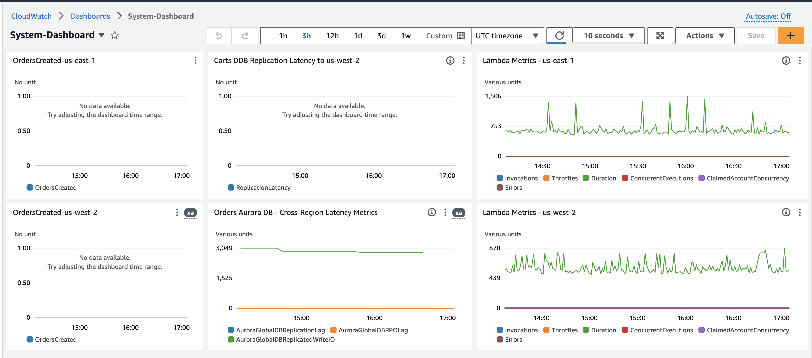

# Guidance for a Multi-Region Microservice on AWS

## Getting started

This guidance helps customers design and operate a multi-Region microservice based architecture for an e-commerce platform on AWS using services like Amazon Elastic Container Services (ECS), Amazon Aurora Global Database, Amazon Aurora DSQL, Amazon DynamoDB Global Tables with multi-Region strong consistency (MRSC), and Application Recovery Controller (ARC) Region Switch. The solution is deployed across two Regions in an active/active configuration where both regions serve traffic simultaneously. This is possible because all services except Catalog are either stateless or use globally strongly consistent datastores (Aurora DSQL for Orders, DynamoDB Global Tables with MRSC for Carts). The Catalog service uses Amazon Aurora Global Database, which is sufficient for active/active because catalog data is read in-region and updated infrequently by an external process (in the event of data loss due to failover, updates can be re-run). The solution leverages an ARC Region Switch Plan to orchestrate regional failover through an automated workflow that scales up ECS services in the target region, fails over the Aurora Global Database, and shifts DNS traffic via ARC-managed Route53 health checks.

## Application Overview

The sample application is an e-commerce platform. The front-end runs as a service in Amazon Elastic Container Service (ECS), supported by back-end microservices (catalog, assets, orders, carts, checkout) for displaying products, adding items to carts, and placing orders. The application uses Amazon Aurora Global Database for the Catalog service, Amazon Aurora DSQL for the Orders service, and Amazon DynamoDB Global Tables with multi-Region strong consistency for the Carts service.


## Architecture

### 1. Operating in the active/active state



1. Amazon Route53 Failover records use Route53 Application Recovery Controller (ARC) managed Health Checks to route requests to the active regions

2. Application Load Balancers (ALB) send requests to the UI tasks on Amazon Elastic Container Service (ECS).  Depending on the page being accessed, the UI will make a service call to the appropriate service via ECS Service Connect

3. The “Catalog” service uses Amazon Aurora Global Database. Writes go to the primary writer instance and are replicated asynchronously to the secondary region. Reads are served locally in each region.

4. The “Orders” service uses Amazon Aurora DSQL, a serverless distributed SQL database that provides active-active replication with strong consistency across regions.

5. The “Carts” service uses Amazon DynamoDB Global Tables with multi-Region strong consistency (MRSC), enabling strongly consistent reads and writes in both regions simultaneously.

6. The checkout service uses Amazon ElastiCache for Redis for temporarily caching the contents of the cart until the order is placed.

7. The orders service leverages Amazon RabbitMQ broker to publish order creation events for any downstream consumption purposes. The publish is best effort and runs off the request path, on a small bounded pool: with the broker down, orders are still saved and answered in time, and the events that can't be sent are logged and dropped.

8. Amazon CloudWatch Synthetics from each region sends requests to the application in each region via the ALB’s address and to the DNS name resolved through Route53 and pushes the metrics, logs and traces to CloudWatch.

9. Amazon Application Recovery Controller (ARC) Region Switch Plan orchestrates regional failover by scaling up ECS services, failing over the Aurora Global Database, and shifting DNS traffic via managed health checks.


### 2. Cross Region Failover 



1. An operator executes the Application Recovery Controller (ARC) Region Switch Plan

2. ARC scales up ECS services to handle 100% of all site traffic

3. ARC then executes Aurora Global Database managed failover which promotes the standby region to the primary for writes (former primary is rebuilt as a secondary by the Aurora service)

4. ARC then toggles the Route53 Health Check for the failing region to “unhealthy” so that DNS returns only the remaining healthy region as clients resolve the application’s fully-qualified domain name

5. An operator uses the SSM runbook to recover a copy of the old primary database from a snapshot and compare the data in the new primary database to the old and create a missing transaction report

The numbers label the diagram. The plan runs them in the order 1, 2, 4, 3: it moves DNS as soon as the remaining Region has scaled up, and switches the database over last. [Automatic failover and fail-back](#3-automatic-failover-and-fail-back) says why.

### 3. Automatic failover and fail-back

The Region Switch plan in [`deployment/failover.yaml`](deployment/failover.yaml) moves traffic away from a Region, and `make failback` brings the Region back.

**What the plan does when it deactivates a Region**, in this order:

1. It scales up the ECS services of the Region that stays, all six in parallel, to twice the highest count they reached in the last 24 hours (15 minutes allowed).
2. It moves DNS. The plan's Route 53 health check for the Region goes unhealthy, so the application's name resolves only to the Region that stays (5 minutes allowed).
3. It switches the catalog database over. The writer of the Aurora global database moves to the Region that stays (10 minutes allowed). This is a switchover, which loses no data.

An operator starts it, at the Region that stays, because the Region being drained may be the impaired one:

```
aws arc-region-switch start-plan-execution --plan-arn <RegionSwitchPlanArn> --action deactivate \
  --target-region <Region to move away from> --mode graceful --region <the other Region>
```

> **Why traffic moves before the catalog database.** The failover plan moves traffic as soon as the healthy Region has scaled up, and only then switches the catalog database's writer to that Region. That order is acceptable because catalog is a low-write database. Shoppers only read it, and each Region reads from its own copy, so the healthy Region serves catalog pages without the writer. Its only writes are the schema and sample product data that the catalog service loads when it first starts, so nothing needs the writer during a failover. If a workload like this one does need to accept writes during an outage, it can queue them and apply them after recovery.
>
> The switchover loses no data. If it can't finish, for example because the primary database is down, the plan pauses with traffic already moved, and a person decides whether to retry it, skip it, or fail over with possible data loss. The automation never makes that trade on its own.

**If the switchover pauses the run.** The execution waits in the state `pausedByFailedStep`, and a paused execution holds the plan: a new execution and `make failback` both wait until a person resolves it. There are three ways out, and only the last can lose data:

- **Retry.** The API has no retry for a failed step. Once the database is healthy, cancel the paused execution (`aws arc-region-switch cancel-plan-execution`) and start the deactivate again. That repeats the scale-up too, which asks for more tasks the second time because ARC sizes it from the highest count of the last 24 hours (never past each service's maximum of 10). This path has not been tried on this sample.
- **Skip the step.** `aws arc-region-switch update-plan-execution-step --step-name switch-over-catalog-db --action-to-take skip --comment <why>` lets the run finish. The writer stays where it is. Each Region keeps reading its own cluster, so only catalog writes wait. `make failback` moves the writer to the primary Region once its database is available.
- **Switch the run to ungraceful.** `aws arc-region-switch update-plan-execution-step --step-name switch-over-catalog-db --action-to-take switchToUngraceful --comment <why>` fails the database over to the Region that stays, and can lose the catalog writes the old primary had not yet replicated. Choose it only when the primary database is not coming back soon and losing those writes is acceptable.

**Failing a Region back.** When the Region is healthy again, run:

```
make failback REGION=<Region>
```

`REGION` is required and must be on the command line. The command needs no Resilience Hub stack. It does these in order and stops where the next step depends on the last:

| Step | What it does |
|---|---|
| Preflight | Refuses, and lists every reason, unless the Region's own journey alarms and the other Region's view of it have been `OK` for 10 minutes, no plan execution is going or paused, and the plan's Route 53 health checks are not all unhealthy. It also refuses a Region that is serving while the other one is the Region DNS moved away from. |
| Activate | Starts the plan's activate workflow for the Region, graceful, at that Region's endpoint, and waits (10 minutes at most). A Region whose health check is healthy already is not activated again. If the execution fails, pauses or runs out of time, the command stops: capacity and the writer are left alone while DNS is in doubt. |
| Capacity | The failover scaled the remaining Region up and nothing scales it down again, so this sets every service's desired count and Auto Scaling minimum back to 2 in both Regions, the values `ecs.yaml` declares. The maximum is left as it is. |
| Writer | If the catalog writer is not in `PRIMARY_REGION`, switches the global database over to the cluster there, and waits for it. After a person chose to fail the database over, the old primary has to rejoin and catch up first, so this waits up to 45 minutes. If it has not by then the writer stays where it is, which is safe, and the command prints what to run to finish. |

Every step reads before it writes, so running the command again after a partial failure repeats nothing that is done. It exits 0 when done, 1 when a step failed, 2 when preflight refused (nothing was changed), and 3 when it finished except for what it says is left for you. The credentials need to read CloudWatch alarms, start and read plan executions, update ECS services and their Application Auto Scaling targets, and switch over the Aurora global database.

Activating the Region in the ARC console runs only the DNS step. It does not put the capacity back or move the writer, so use `make failback`.

**Measurement and reports.** The plan has a recovery time objective of 10 minutes. ARC measures it from the start of an execution until the application health alarms, the `journey-global-*` alarms of both Regions, are green, and writes a report of each execution (the step timeline, the alarms' states and the recovery time against the objective) to the stack's reports bucket, named in the output `ReportsBucketName`, under `executions/`. Reports expire after 90 days. The plan also lists the other journey alarms (`journey-lcl-*`, `journey-rmt-*` and `region-degraded`) as trigger alarms.

**The automatic-failover switch.** `make deploy AUTOMATIC_FAILOVER=disabled` (the default is `enabled`) leaves out the permission that lets the plan's execution role start the plan, which an execution started by an alarm needs. The plan has no alarm triggers yet, so today only an operator starts it.


## Resilience Modeling with AWS Resilience Hub

The `make ngrh` target models this application in AWS Resilience Hub (`resiliencehubv2`) so its resilience can be assessed against explicit RTO/RPO targets. The model has three layers — **user journeys**, **services**, and **resiliency policies (tiers)** — described below along with the rationale for each mapping.

### User journeys → services

A *user journey* is a business-meaningful path through the application. Each journey depends on the ECS services that fulfill it:

| User journey | Services exercised |
|---|---|
| Browse Catalog | ui, catalog, assets |
| Manage Cart | ui, cart |
| Checkout & Place Order | ui, checkout, orders, cart |
| View Orders | ui, orders |

Notes:
* `ui` is the only public entry point (ALB + Route 53/ARC health checks) and fans out to the backends via ECS Service Connect, so it participates in every journey.
* `checkout` orchestrates the order: it reads the cart and calls `orders` to create the order on submit (an inter-service dependency beyond the UI-centric hub-and-spoke diagram).
* Operational concerns (CloudWatch Synthetics canaries, the ARC Region Switch runbook) are **not** modeled as journeys — they are detection/recovery mechanisms, not user-facing paths.

### Resiliency policies (tiers)

Two policies express the resilience requirements. Each uses **one RTO/RPO bar applied across all disruption types** (AZ, hardware, software, Region); the per-disruption breakdown comes from the assessment, not from differentiated targets.

| Tier | RTO | RPO | Applied to journeys |
|---|---|---|---|
| **Tier-1** (revenue funnel) | 10 min | 0 | Browse Catalog, Checkout & Place Order |
| **Tier-2** (standard) | 15 min | 5 min | Manage Cart, View Orders |

Justification:
* **Tier-1 = the revenue funnel.** Browsing the catalog gates *all* sales (no browse → no purchase) and checkout is the revenue transaction itself, so both get the strictest targets.
* **Tier-1 RTO is 10 minutes — the realistic Active/Active floor.** Resilience Hub treats ~10 minutes as the minimum achievable RTO for an Active/Active topology (failure detection + DNS TTL + connection drain + service stabilization). An aspirational 5-minute target is flagged as unachievable across every service, which drowns out the genuinely actionable findings; 10 minutes is the honest target and lets the real architecture gaps surface.
* **Tier-2 = important but degraded-tolerable.** Managing the cart (mid-funnel) and viewing past orders (post-purchase/support) can tolerate a longer recovery and small data-loss window without direct revenue impact.
* **RPO 0 for Tier-1 is honest for the write path** because Orders uses Aurora DSQL and Carts uses DynamoDB Global Tables — strongly consistent across Regions. The only data lost in a regional failover is in-flight checkout session state in ElastiCache (not a system of record; the customer simply re-enters it).
* **Browse Catalog is a read path on Aurora Global Database (asynchronous replication),** so a strict RPO 0 is not physically achievable there. This is an accepted compensating control rather than a defect: catalog data is read-only in-Region and written by an external, re-runnable ingest from an external system of record, so any unreplicated catalog updates are recovered by re-running ingest with no unrecoverable data loss. This rationale is recorded as a Resilience Hub **assertion** on the `catalog` service.

### Service tier = strictest journey it serves

A service can carry only one policy, so each service inherits the **strictest tier of any journey it participates in**:

| Service | In journeys | Effective tier |
|---|---|---|
| ui | all four (incl. two Tier-1) | Tier-1 |
| catalog | Browse Catalog (T1) | Tier-1 |
| assets | Browse Catalog (T1) | Tier-1 |
| checkout | Checkout & Place Order (T1) | Tier-1 |
| orders | Checkout (T1) + View Orders (T2) | Tier-1 |
| cart | Checkout (T1) + Manage Cart (T2) | Tier-1 |

All six services resolve to Tier-1 because every service participates in at least one revenue-funnel (Tier-1) journey. This is intentional: a service shared between a Tier-1 and a Tier-2 journey **must** meet the stricter target to satisfy the Tier-1 journey. The tier differentiation therefore lives at the **journey** layer (two Tier-1, two Tier-2), while the **service** layer is uniformly Tier-1 here. An application with services used *exclusively* by lower-tier journeys would show a mix of service tiers.

### Region scope

The application is modeled as a single multi-Region system with `disasterRecoveryApproach = ACTIVE_ACTIVE` for both the multi-AZ and multi-Region targets — both Regions serve traffic and the data tier is strongly consistent (Aurora DSQL, DynamoDB Global Tables). ECS capacity that ARC scales up on failover is reflected as a contributor to recovery time (RTO), not as a different DR classification.

### How each service finds its resources

Each service discovers its resources by tag, not by CloudFormation stack. Its input source matches resources whose `service` tag is the service's own name or `shared`, and dependency discovery follows the connections from there.

* **Resources one service owns carry its name.** For example, the carts ECS service, its task definition, task role and ECR repository, the DynamoDB table and the cart alarms all carry `service=cart`.
* **Resources the whole application relies on carry `service=shared`**, for example the VPCs, the load balancer, global routing, the Region Switch plan and the alarms that watch every journey.
* **Where the tags come from:** stacks with a single owner, such as the databases, and fully shared stacks get the tag as a stack tag from the Makefile, which CloudFormation applies to every resource in the stack that supports tags. Stacks that mix owners (`apps`, the canaries, monitoring and the base infrastructure) tag each resource in the template.
* **The ECS cluster has no `service` tag.** All six services run on it, so tagging it would make every service discover all the others through the cluster.

This narrows each service's assessment to its own resources and the shared ones. For example, catalog's assessment no longer covers checkout's Redis, which stack discovery included because every service listed the `apps` stack.

**Upgrading a deployment that already has the model.** Changing a service's input sources in place doesn't change what Resilience Hub has already discovered for it, so recreate the services:

1. Run `make deploy` so the application's resources carry the tags.
2. Run `make destroy-ngrh`, then `make ngrh`. Deleting the stack also empties its report bucket, so download any reports you want to keep first.
3. Wait at least 4 hours for discovery to settle before running assessments. Expect different findings, because each service now covers fewer resources.

### Running Resilience Hub tests

The `ngrh` stack also creates the two IAM roles a Resilience Hub test run executes as:

* **`ngrh-invoker${ENV}`** is each service's invoker role. Besides the assessment policy it carries `AWSResilienceHubResilienceTestingPolicy`, which lets Resilience Hub create, start and stop the AWS FIS experiment behind a test run. Without it every test run fails at `fis:CreateExperimentTemplate`.
* **`ngrh-test-experiment${ENV}`** is the role to choose as the test's IAM role. FIS assumes it to inject the faults, and it carries the permissions the FIS actions reference lists for every action in the four Resilience Hub test templates (Availability Zone recovery, dependency validation, multi-Region isolation, multi-Region recovery). Only FIS experiments in this account can assume it.

People running tests do not need to create IAM roles. They need `iam:PassRole` on these two roles (passed to `resiliencehub.amazonaws.com` and `fis.amazonaws.com`) and pick them when they create a test.

Faults on ECS tasks (`aws:ecs:task-network-packet-loss`, used by the dependency validation and both multi-Region templates) need three things in the task definition ([requirements](https://docs.aws.amazon.com/fis/latest/userguide/ecs-task-actions.html#ecs-task-requirements)), and every task definition in this sample has them:

* **An SSM agent sidecar** (`amazon-ssm-agent`, non-essential). It registers the task as an SSM managed instance tagged with the task's ARN, which is how FIS finds the task. The task subnets have no internet route, so the sidecar runs an image built into your account's ECR (`amazon-ssm-agent<ENV>`) from `deployment/ssm-agent-sidecar.Dockerfile`, with the commands it and the FIS fault documents run baked in. `make mirror-sidecar-images` builds it on a first deployment, and the weekly repave rebuilds it, checking each of those commands in the new image before it replaces the one your tasks pull. A bare SSM agent image in its place starts a sidecar that exits at once (no `aws`, no `ps`), no task registers with SSM, and Resilience Hub's ECS faults then fail with "At least one ECS Task is not registered as a SSM managed instance".
* **`pidMode: task`**, so the sidecar can reach the application's processes.
* **`enableFaultInjection: true`**, which turns on the ECS fault-injection endpoints that FIS network faults use on Fargate.

Each task role can create the sidecar's SSM activation and pass the managed-instance role to SSM, and nothing else is added to it. ECS Exec stays off, because FIS can't run these actions on a task that has it enabled.

**Upgrading a deployment that already has the weekly repave.** The repave's commands are part of its stack, and it clones `main` for the files they read. Run `make self-update` once the sidecar is on `main`; a repave still running the older commands would copy the bare SSM agent image over the sidecar's image, because it mirrors every public image the sidecar buildspec names. After that, `make mirror-sidecar-images` (or the next repave) rebuilds the image, and the service's tasks need replacing to pick it up. A live `make ngrh-test-preflight` says which tasks aren't registered with SSM.

### Testing resilience with NGRH

The tests live in [`deployment/ngrh-tests.json`](deployment/ngrh-tests.json), not in CloudFormation: Resilience Hub has no test resource, and creating a test twice is an error, so a small tool (`python3 -m ngrh_testing`, standard library only, run from `deployment/`) reads the file and makes Resilience Hub match it. Each test says which service it faults, which template it uses, what to block, which alarms decide the verdict, and what result the sample is expected to give. [`docs/ngrh-test-ground-truth.md`](docs/ngrh-test-ground-truth.md) explains each expectation. The first test, `orders-broker-dependency`, blocks orders' traffic to its Amazon MQ broker for 15 minutes.

Run them after `make deploy`, `make monitoring` and `make ngrh`:

| Command | What it does |
|---|---|
| `make ngrh-tests` | Creates each test that doesn't exist and updates one that differs from the spec, then makes its alarm sources match. Safe to repeat: a test that matches is left alone, and nothing is ever deleted. It stops before writing anything if a reference doesn't resolve, an alarm or template doesn't exist, or a service has two tests for one template. |
| `make ngrh-test-preflight [TEST=<name>\|all] [MODE=live\|static]` | Lists every reason a run should not go ahead, or says all checks passed. `MODE=static` checks only the configuration (roles, tests, alarms exist, the service can take the fault); the default `live` also checks the alarms are `OK` and that no test run, FIS experiment or plan execution is active. Exits 2 when refused. |
| `make ngrh-test TEST=<name> [ALARM_WAIT=<minutes>] [SETTLE_WAIT=<minutes>]` | Runs the live preflight, starts the run, follows it until it ends (the test's duration plus 20 minutes at most), waits `SETTLE_WAIT` minutes (default 10) so the alarms' recovery is in the report, and writes it. `ALARM_WAIT` first waits up to that many minutes for the test's success and stop alarms to have data, which a new deployment's alarms don't until its canaries have reported. This injects a real fault into the deployed sample. Exits 0 when the verdict is the expected one and 3 when it isn't, including when the fault never ran (a verdict of `INCONCLUSIVE`). |
| `make ngrh-test-stop TEST=<name> [STOP_WAIT=<minutes>]` | Asks the test's active run to stop, and with `STOP_WAIT` waits up to that many minutes for it to end. |
| `make ngrh-test-report TEST=<name> [RUN=<id>]` | Collects a run's report again (the latest run by default), for example after a run you did not watch. |

A run cannot start while any Resilience Hub service in the account has an active run, so tests that share resources never overlap, and a tester's own run on another service counts too.

A test's success and observability alarms must be alarms Resilience Hub discovered for that service, which it finds by the service's tag input sources (orders: `service` is `orders` or `shared`). An alarm tagged for another service, such as `hop-checkout-errors` (tagged `checkout`), is refused by `StartTestRun` with "alarms not discovered for this service", however recent the assessment. Preflight reads the service's input sources and each source alarm's tags and refuses before the run starts; put such an alarm in `evidenceAlarms`, which the report reads from alarm history without Resilience Hub's involvement.

If your terminal drops or you press Ctrl-C, the run carries on in AWS: nothing is stopped for you. The tool prints the two commands to use later, `make ngrh-test-stop` and `make ngrh-test-report`.

**In GitHub Actions**, every run of the `e2e` workflow creates the tests and runs the static preflight once the deploy has finished (the steps `Reconcile NGRH tests` and `Check NGRH tests (static preflight)`), so a change that breaks a test's references fails the pull request. No fault is injected. To run a fault test there, start the workflow by hand (Actions, then `e2e`, then Run workflow) and choose a test in `ngrh_test`; the default, `none`, runs none. The job waits up to 15 minutes for the test's alarms to have data, runs the test after the smoke test and before teardown (waiting ten more minutes after the run, so the report has the alarms' recovery), and attaches the report to the run as the `ngrh-test-reports` artifact, also when the test fails. The step fails when the verdict isn't the expected one. If the job is cancelled while a run is going, a last step asks it to stop and waits up to 10 minutes, because teardown deletes the tests and refuses while a run is active. Resilience Hub discovers the resources of a new deployment over the hours after it is created, so a fault run on a fresh deployment may reach fewer targets than one on a deployment that has been up a while: the report lists the targets it reached.

**The report** is written to `deployment/ngrh-test-reports/<test>-<run>.md` with the full data beside it as `.json` (the directory is not committed). It starts with the verdict against the expectation, then what Resilience Hub watched and each alarm's outcome, a timeline, the targets the fault reached and the dependencies it blocked. It also shows the state changes of alarms Resilience Hub doesn't watch, laid out by hop: both Regions' `region-degraded`, then ui and each back-end in turn. That layout is how you trace a journey that failed to the service behind ui that caused it. A run that ends `ERROR` carries no message when the invoker role was denied a call: look for `AccessDenied` in CloudTrail around the start time.

`make destroy-ngrh` deletes the tests before the stack, because deleting a service that still has tests is not documented to work. It refuses while a run is active.


## Pre-requisites

* To deploy this example guidance, you need an AWS account (We suggest using a temporary or a development account to 
  test this guidance), and a user identity with access to the following services:

    * AWS CloudFormation
    * Amazon Virtual Private Cloud (VPC)
    * Amazon Elastic Compute Cloud (EC2)
    * Amazon Elastic Container Services (ECS)
    * Amazon Relational Database Service (RDS)
    * Amazon ElastiCache for Redis
    * Amazon Aurora Global Database 
    * AWS Identity and Access Management (IAM)
    * AWS Secrets Manager
    * AWS Systems Manager
    * Amazon Route 53
    * AWS Lambda
    * Amazon CloudWatch
    * Amazon Simple Storage Service
    * Amazon Application Recovery Controller

* Install the latest version of AWS CLI v2 on your machine, including configuring the CLI for a specific account and region
profile.  Please follow the [AWS CLI setup instructions](https://github.com/aws/aws-cli).  Make sure you have a 
default profile set up; you may need to run `aws configure` if you have never set up the CLI before. 

* Install Python version 3.12 on your machine. Please follow the [Download and Install Python](https://www.python.org/downloads/) instructions.

* Install `make` for your OS if it is not already there.

* Install `zip` for your OS if it is not already there (used to package source for AWS CodeBuild). Container images are built via AWS CodeBuild — no local Docker installation is required.

### Regions

This demonstration by default uses `us-east-1` as the primary region and `us-west-2` as the backup region. These can be changed in the Makefile.

## Deployment

For the purposes of this workshop, we deploy the CloudFormation Templates via a Makefile. For a production workload, you'd want to have an automated deployment pipeline.  As discussed in this 
[article](https://aws.amazon.com/builders-library/automating-safe-hands-off-deployments/?did=ba_card&trk=ba_card), a multi-region pipeline should follow a staggered deployment schedule to reduce the blast radius of a bad deployment.  
Take particular care with changes that introduce possibly backwards-incompatible changes like schema modifications, and make use of schema versioning.


## Configuration
Before starting deployment process please update the following variables in the `deployment/Makefile`:

**ENV** - It is the unique variable that indicates the environment name. Global resources created, such as S3 buckets, use this name. (ex: -dev)

**PRIMARY_REGION** - The AWS region that will serve as primary for the workload

**STANDBY_REGION** - The AWS region that will serve as standby or failover for the workload

## Deployment Steps

We use make file to automate the deployment commands. The make file is optimized for Mac. If you plan to deploy the solution from another OS, you may have to update few commands.

1. Deploy the full solution from the `deployment` folder
    ```shell
    make deploy
    ```

## Verify the deployment

**Deployment Outputs**

Verify deployment outputs after a successful deployment. If you are deploying the solution to **us-east-1** a sample deployment output will look like this:- 

Canaries:
* https://us-east-1.console.aws.amazon.com/cloudwatch/home?region=us-east-1#synthetics:canary/list
* https://us-west-2.console.aws.amazon.com/cloudwatch/home?region=us-west-2#synthetics:canary/list

Region Switch Plan:
* Use `aws arc-region-switch start-plan-execution` to initiate failover

**Optional Windows clients (diagnostics only)**

Windows EC2 clients for in-VPC browser testing are **not** deployed by default.
If you need them for diagnostics, deploy them in both regions with:

```bash
make client ENV=<env>
```

This prints the Fleet Manager console links and the Administrator password
secret locations for each client. `make destroy-all` still cleans them up if
they were deployed.

## Observability

Each Region is provisioned with a CloudWatch dashboard that shows the healthchecks as reported by the Synthetic Canaries in each Region. 



In addition, a System Dashboard is also provisioned that shows key metrics like the Order created in each Region, and the replication latency metrics for 
DynamoDB and Aurora Global database.



### Container health checks

ui is behind the ALB, whose health check gates its deployments. Each back-end (carts, orders, catalog, checkout, assets) has a container health check instead: during a deployment ECS stops the old tasks only after the new ones pass it, and it replaces a task that stops answering. The checks call endpoints that check no dependencies (Spring's readiness group for carts and orders, `/health` for catalog and checkout, `health.html` for assets), so a database or broker outage never makes ECS replace tasks. Their start periods cover the slowest start seen in testing: 240 seconds for carts, 120 for orders and 60 for the others.

Without them, ECS stopped the old back-end tasks as soon as the new containers started, and every deployment failed the journeys for 4-5 minutes in the Region being deployed: carts took up to 4 minutes to start, and ui calls carts on every page.

Deployments also avoid failing requests while tasks are replaced:

* **Shutdown delay.** Callers' Service Connect proxies can still send a stopping task requests for a few seconds after its application gets the stop signal, and once the application has exited, the task's own proxy answers them with 503. Each back-end task therefore runs a small `shutdown-delay` container that depends on the application. A container dependency reverses at shutdown, so ECS sends the application its stop signal only after `shutdown-delay` exits, 15 seconds (`SHUTDOWN_DELAY_SECONDS`) after ECS signals it, and the application keeps serving until then. In testing the applications got their stop signal about 26 seconds later than before, because ECS took another 11 seconds or so to move on to them. ui doesn't need one: the ALB stops sending a ui task requests before ECS stops it.
* **carts warm-up.** The first request a new carts process serves builds its DynamoDB client, fetches the task's credentials and opens its first connection to DynamoDB. That took up to 4.7 seconds on 0.5 vCPU, longer than the 3-second Service Connect timeout on ui's calls. carts now sends itself one cart request at startup, before its readiness probe passes, so its first real request is fast. If the warm-up fails or takes longer than 10 seconds (`carts.startup-warmup.timeout`), carts starts anyway, so a DynamoDB outage can't keep it from starting.

## Injecting Chaos to simulate failures
To induce failures into your environment, you can use the `multi-region-scenario.yml` and cause a regional service disruption. This cloudformation template uses AWS Fault Injection Service to simulate disruptions like pausing DynamoDB Global Table replication and disrupting cross region network connectivity from subnets. Running this experiment will also allow you to perform a Regional failover and observe the reconciliation process.

The chaos experiment template is already deployed as part of the solution deployment process.

The following sequence of steps can be used to test this solution.

1. The first step is to get the experimentTemplateId to use in our experiment; use the below command for that and make a note of the id value
`export templateId=$(aws fis list-experiment-templates --output json --no-cli-pager | jq -r '.experimentTemplates[] | select(.tags["Name"] == "Cross-Region: Connectivity to us-west-2") | .id')`

2. Execute the experiment in the primary Region (us-east-1) using the following command using the templateId from the previous step.
`aws fis start-experiment --experiment-template-id $templateId`

## Cleanup

Note: If you have created reconciliation Amazon Aurora Database Clusters and Database Instances in the Standby Region, please delete all those instances before going to the next step.

Delete all the cloudformation stacks and associated resources from both the Regions, by running the following command from the `deployment` folder
    ```shell
    make destroy-all
    ```

## Cost

The following table provides a sample monthly cost breakdown for running the
default deployment 24/7 in the US East (N. Virginia) and US West (Oregon)
Regions. Numbers are derived from the templates in `deployment/` (resource
counts, instance sizes, schedules) and current public AWS list pricing for
those Regions; usage-driven items (data transfer, log volume, DSQL
Processing Units) are estimated for an idle / light-load workload and will
scale with traffic.

The default canary schedule (`rate(1 minute)` × 12 canaries × 2 Regions) is
the single largest contributor. Reducing canaries to a 5-minute schedule
drops monthly cost by roughly $1,000.

## Summary
| Cost Type | Amount (USD) |
|-----------|-------------|
| Upfront Cost | $0.00 |
| Monthly Cost | ~$3,348 |
| Total 12 Months Cost* | ~$40,200 |

\* Includes upfront cost. Most line items are flat 24/7 — actual cost will
vary with the canary schedule, log retention, and workload volume.

## Detailed Estimate

### Per-Region Costs (each of US East and US West)

| Service | Monthly Cost | Configuration |
|---------|--------------|----------------|
| ECS Fargate | $346 | 6 services × 2 tasks on on-demand Fargate: 4 × (1 vCPU / 2 GB), carts (0.5 vCPU / 1 GB) and assets (0.25 vCPU / 1 GB), Linux/x86 24/7. Each task also runs the SSM agent sidecar used for fault injection, which is why the two small services have 1 GB. Fargate Spot would cost about $104, but Spot can reclaim tasks in the middle of a failover or a resilience test |
| Application Load Balancer | $20 | 1 internal ALB ($16 base + ~$4 LCU) |
| VPC Interface Endpoints | $329 | 15 endpoints × 3 AZs × $0.01/AZ-hr (S3 + DynamoDB are gateway endpoints, free) |
| Aurora MySQL Serverless v2 | $175 | 2 instances × 1 ACU minimum × $0.12/ACU-hr (idle) |
| Amazon MQ (RabbitMQ) | $65 | mq.m7g.medium single-instance broker |
| ElastiCache for Redis | $12 | cache.t3.micro single-node replication group |
| CloudWatch Synthetics | $620 | 12 canaries × 1-minute schedule × $0.0012/run (DOMINANT cost) |
| Windows EC2 client | $15 | optional (`make client`), t3.small for in-VPC browser testing — not deployed by default |
| DynamoDB Global Table (MRSC) | $0.30 | small dataset, replicated to other Region |
| DynamoDB Streams | $0.001 | low GetRecord volume |
| AWS FIS | $2 | chaos experiments, 20 action-minutes/run |
| Secrets Manager | $20 | ~50 secrets ($0.40 each) |
| KMS | $1 | 1 multi-Region CMK + light request volume |
| CloudWatch Logs | ~$30 | ECS task + app logs (varies with traffic) |
| **Per-Region subtotal** | **~$1,635** | |

### Shared / Global Costs (charged once, not per Region)

| Service | Monthly Cost | Configuration |
|---------|--------------|----------------|
| Aurora DSQL | ~$5 | multi-Region active-active cluster, idle storage + low DPU |
| ARC Region Switch | $70 | 1 plan |
| Route 53 | $2 | 1 hosted zone + 2 ARC-managed health checks |
| AWS CodeBuild | $1 | sidecar mirror builds, ~6 × 5 min |
| **Global subtotal** | **~$78** | |

### Total

| | Monthly Cost |
|---|---|
| US East (N. Virginia) | ~$1,635 |
| US West (Oregon) | ~$1,635 |
| Shared / global | ~$78 |
| **Total** | **~$3,348** |

### Cost-reduction levers

If the goal is to evaluate the architecture rather than continuously exercise
it, the following changes drop ~$1,300/month without affecting the
multi-Region pattern itself:

* Increase canary schedule from `rate(1 minute)` to `rate(5 minutes)` in
  `deployment/canaries.yaml` → saves ~$1,000/month.
* Trim VPC interface endpoints to a single AZ (or rely on NAT for the
  services that don't need private connectivity) → saves up to ~$220/month.
* Windows EC2 clients are opt-in (`make client`) — skip them entirely, or
  shut them down when not in use → saves ~$30/month.
* Run `make destroy-all` between evaluation sessions and redeploy on
  demand — the templates create cleanly and most stateful resources are
  small at idle.

## Acknowledgement
*AWS Pricing Calculator provides only an estimate of your AWS fees and doesn't include any taxes that might apply. Your actual fees depend on a variety of factors, including your actual usage of AWS services.*
*More than 100 AWS products are available on AWS Free Tier today. Click [here](https://aws.amazon.com/free/) to explore our offers.*

*Note: We recommend creating a [Budget](https://docs.aws.amazon.com/cost-management/latest/userguide/budgets-managing-costs.html) through [AWS Cost Explorer](https://aws.amazon.com/aws-cost-management/aws-cost-explorer/) to help manage costs. Prices are subject to change. For full details, refer to the pricing webpage for each AWS service used in this Guidance.*

## Security
See [CONTRIBUTING](CONTRIBUTING.md) for more information.

### Considerations

The codebase does not address these CDK_NAG rules since this code is NOT INTENDED for Production usage. The codebase has been created with the sole intention of demonstrating multi-Region architectural patterns with the assumption that the end-user will harden the codebase to meet the security considerations as required.

Security scan suppressions for Checkov, cfn-guard, and cfn_nag findings are documented inline on the affected CloudFormation resources via `Metadata` blocks. OpenAPI scan suppressions are in `.checkov.yaml`. The following findings are in non-CloudFormation files where inline suppression is not supported:

| Rule ID            | Cause                                                                                                                         | Explanation                                                                                                                                                                                                                                                                                                           |
| ------------------ |-------------------------------------------------------------------------------------------------------------------------------|-----------------------------------------------------------------------------------------------------------------------------------------------------------------------------------------------------------------------------------------------------------------------------------------------------------------------|
| AwsSolutions-SMG4  | The secret does not have automatic rotation scheduled for resources ARNs being stored as secrets.                             | The demo code leverages secrets manager to share information about AWS resources like ARNs across Regions. Such secrets are not eligible for rotation. However, Aurora databases credentials being used and setup for rotation using the [secrets-rotation](deployment/database/secrets-rotation) stack.              |
| AwsSolutions-IAM5  | The IAM entity contains wildcard permissions and does not have a cdk-nag rule suppression with evidence for those permission. | IAM role and permissions used by services like the AWS Fault Injection Service are scoped not a specific resources because multiple resources will get affected when simulating a regional power outage scenario. In cases such as these, the permissions are restricted to resources within the same account though. |
| AwsSolutions-IAM4  | The IAM user, role, or group uses AWS managed policies.                                                                       | This is a demo codebase, hence using AWS managed policies where possible.                                                                                                                                                                                                                                             |
| AwsSolutions-RDS10 | The RDS instance or Aurora DB cluster does not have deletion protection enabled.                                              | This is a demo codebase, hence deletion protection is not enabled.                                                                                                                                                                                                                                                    |
| AwsSolutions-RDS11 | The RDS instance or Aurora DB cluster uses the default endpoint port.                                                         | This is a demo codebase, hence default ports are used for RDS.                                                                                                                                                                                                                                                        |
| AwsSolutions-RDS14 | The RDS Aurora MySQL cluster does not have Backtrack enabled.                                                                 | This is a demo codebase, hence backtracking is not enabled.                                                                                                                                                                                                                                                           |
| bosco/external-cdn | External CDN reference in UI layout template.                                                                                 | The demo UI references Bootstrap CSS from a public CDN. In production, host static assets on Amazon CloudFront or S3.                                                                                                                                                                                                 |
| bosco/non-ecr-docker-image | Dockerfiles pull base images from public registries (ECR Public Gallery, gcr.io distroless), not from private ECR.          | Expected for an open-source sample. Bases are pulled from the ECR Public Gallery with authenticated logins rather than from Docker Hub, whose anonymous rate limit failed image builds in CodeBuild. In production, mirror base images to private ECR repositories.                                                    |
| B303 / python.sqlalchemy.security | MD5/SHA1 usage and raw SQL in vendored PyMySQL library.                                                         | These findings are in third-party vendored code (PyMySQL 1.1.0), not project code. The library is MIT-licensed and widely used.                                                                                                                                                                                       |

## License
This library is licensed under the MIT-0 License. See the [LICENSE](LICENSE) file.